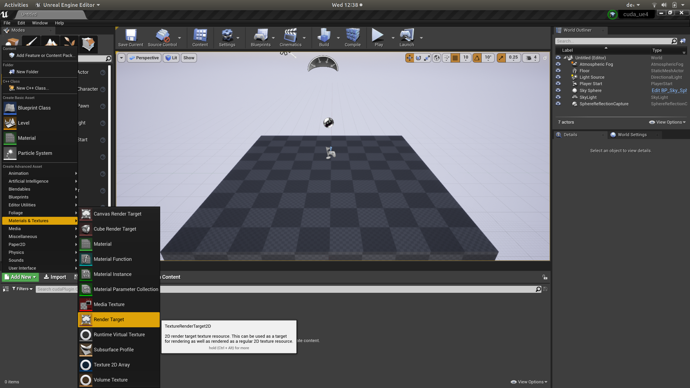
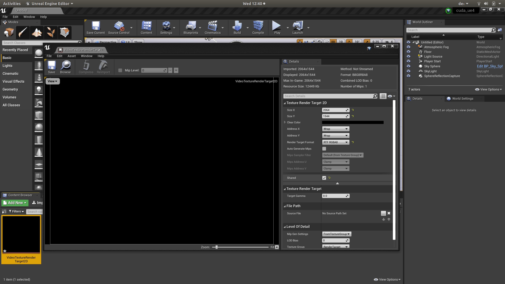
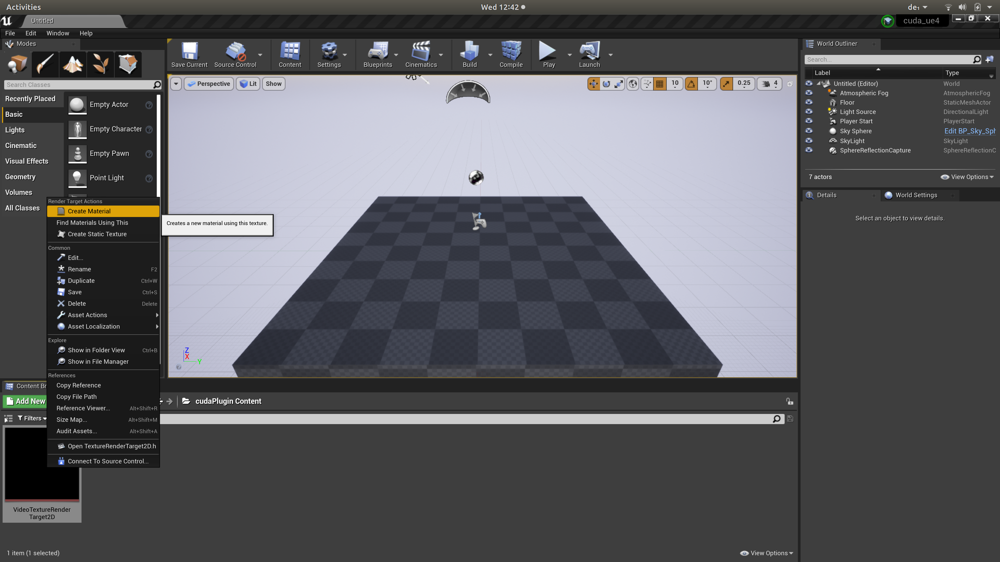
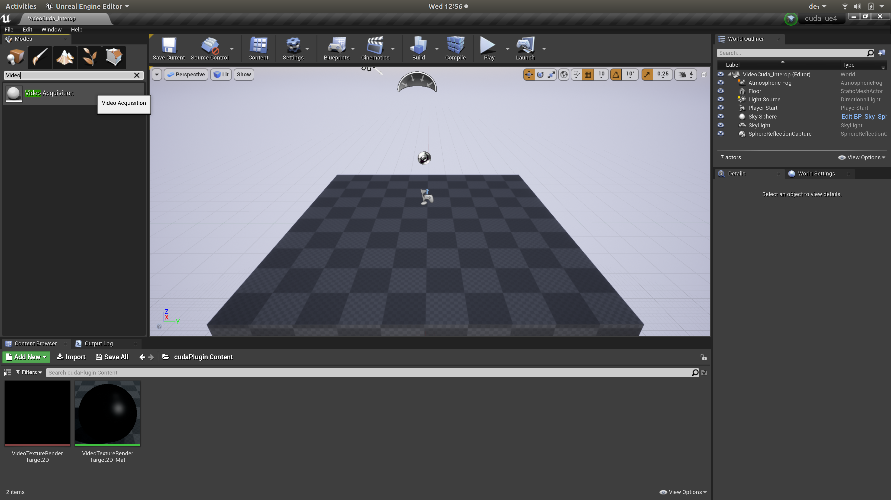
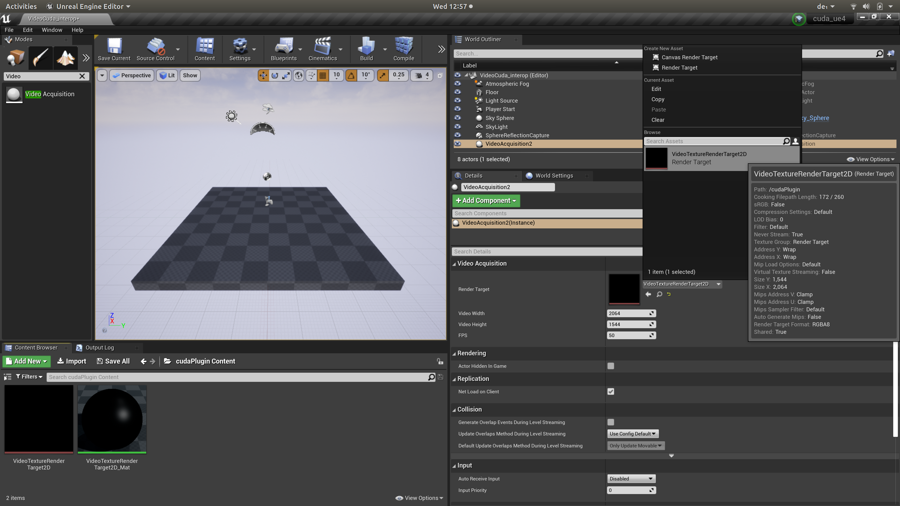
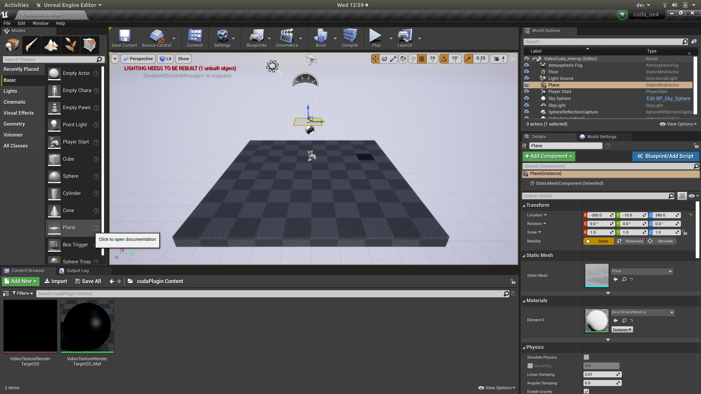
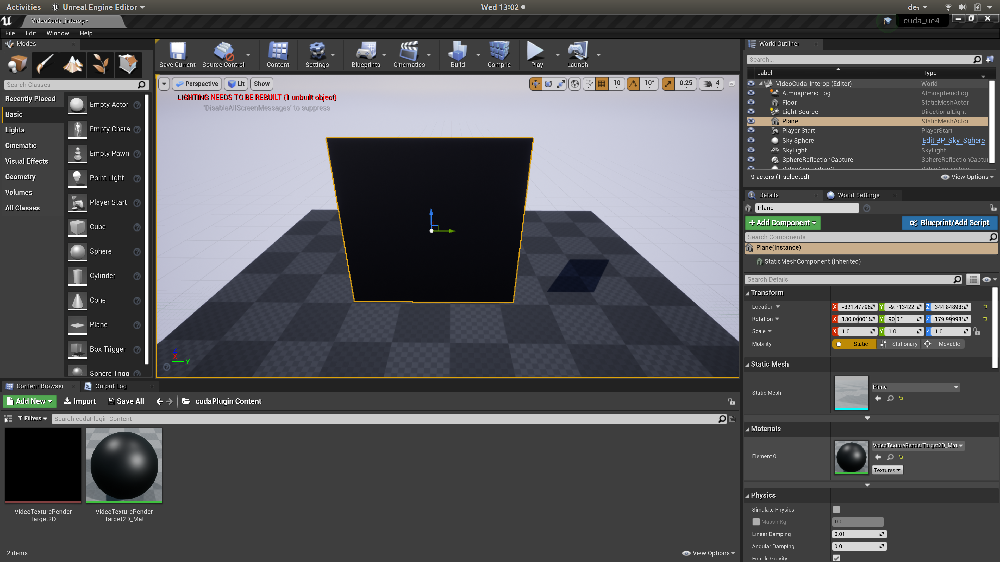

# CUDA UE4 Plugin
Unreal Engine Plugin to directly display High Resolution Video Streams that are pre-processed by Nvidia CUDA.

### Tested with Unreal Engine 4.24.3

### Dependencies
* [NVIDIA GPU Computing Toolkit](https://developer.nvidia.com/cuda-downloads) must be installed.

## Installation
#### Add the Plugin to a project
Create a new project in Unreal Engine or use an existing one.

* Navigate to the projects root directory (where the `*.uproject` file is located)
* Create the directory `Plugins` if it does not exist.
* Copy the whole folder `cudaPlugin` into `Plugins`.

#### Adjust the path for the CUDA libraries

* Edit the file `.../Plugins/cudaPlugin/Source/cudaPlugin/cudaPlugin.Build.cs`
* Find the line `string cuda_path = "/usr/local/cuda";` and adjust it to match your CUDA installation directory.

#### Restart the Unreal Engine Editor
The editor should detect the Plugin after the restart.

#### Add the module to the project dependencies
In the `projectName.Build.cs` file, add `cudaPlugin` as a dependency.

The according code block should look like:
```
PublicDependencyModuleNames.AddRange(new string[] {
                "Core",
				...
                "cudaPlugin");
```


## Usage
For each video stream the following objects are required.

* A **Texture Render Target 2D**: The texture on which the video stream will be rendered. This is the shared component between Unreal and CUDA.
* A **Material**: The material is created from the texture and can be applied to meshes.
* A **VideoReceiver**: The actor that handles the video receivement and decoding.
* A **MeshActor**: The scene object on which the video is rendered.

#### Texture Render Target 2D
In the Content Browser click on **Add New** 🠆 **Materials & Textures** 🠆 **Render Target**



Double-Click on the created object to edit it and adjust the following settings:



* **Size X** and **Size Y** should match the resolution of the video stream.
* **Render Target Format** must be set to **RTF RGBA8**
* **Shared** must be checked to allow writing to the Render Target from CUDA.

Click on **Save** to apply the changes.

#### Material
Right-Click on the RenderTarget and select **Create Material** to create a material from this texture.



By Double-Clicking on the created Material, the surface properties like *Specularness* and *Roughness* can be adjusted.

#### VideoAcquisition
Create an instance of the **Video Acquisition** class. Search for it in the **Modes**-Tab and then drag-n-drop it into the Scene-View.



In the **Details**-Tab of the created actor, make the following adjustments:

* Select the **Render Target** that you created before as the **Render Target**.
* **Video Width** and **Video Height** should match the resolution of the video.




#### Mesh Actor
Create the mesh on which the texture is rendered. Typically a simple **Plane** is a good choice. Drag-n-Drop it into the Scene-View.



* Set the previously created Material as the **Material** of the Mesh.
* The ratio of the **Scale** should match the aspect ratio of the video to avoid distortion.



## Known Issues
### CUDA Ressource Cleanup
The cleanup of the CUDA ressources at the end of a program run seems to be incomplete. If you start the game from Unreal Editor, end it and start iot again, the allocation of the shared textures fails.
The **Unreal Editor** must be **restartet** to fix this.
